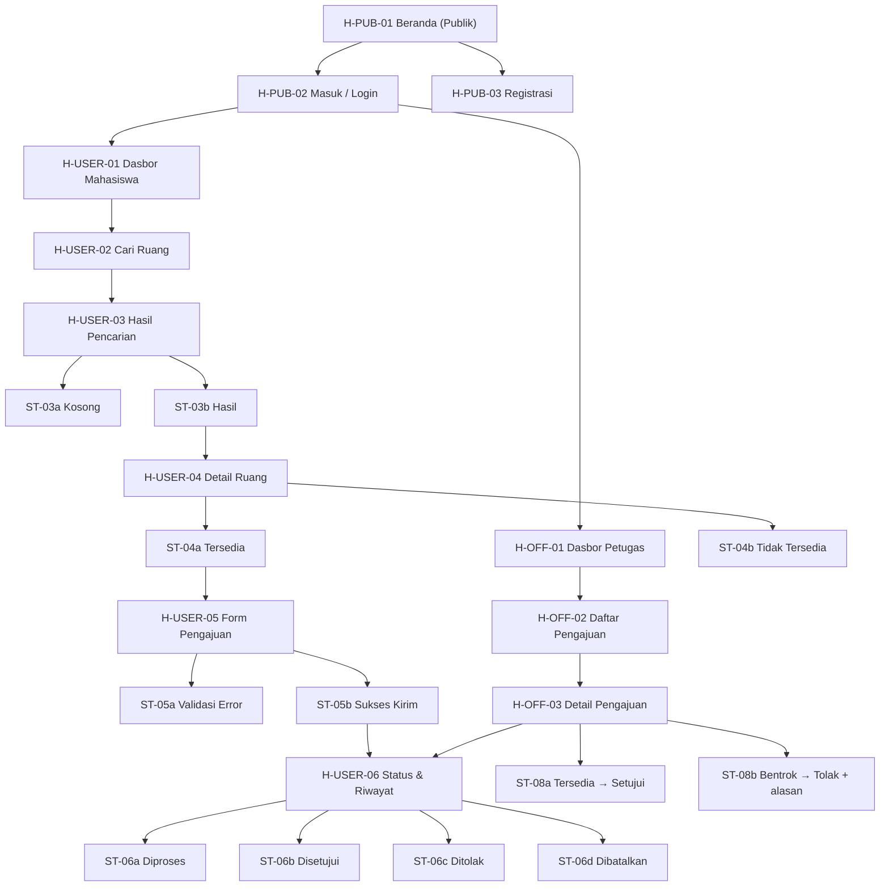

# 02 — Sitemap & Arsitektur Informasi

**SIRPEK — Sistem Peminjaman Ruang dan Peralatan Kampus**

Sitemap hierarki maksimal **3 level** (Level 1 / Level 2 / Level 3 *state*).
Pembagian peran: **Publik** → **Pengguna terautentikasi (mahasiswa)** → **Petugas/admin**.

---

## 1. Arsitektur Informasi (format tabel)

### Level 1 — Halaman Publik

| ID Halaman | Nama Halaman | Peran | Tujuan |
|------------|--------------|-------|--------|
| H-PUB-01 | Beranda (landing) | Publik | Memperkenalkan SIRPEK dan gerbang masuk ke semua fungsi |
| H-PUB-02 | Masuk (Login) | Publik | Autentikasi mahasiswa & petugas (US-P-01) |
| H-PUB-03 | Registrasi | Publik | Membuat akun menggunakan akun kampus (US-P-01) |

### Level 2 — Pengguna Terautentikasi (Mahasiswa/Peminjam)

| ID Halaman | Nama Halaman | Peran | Tujuan |
|------------|--------------|-------|--------|
| H-USER-01 | Dasbor Mahasiswa | Mahasiswa | Titik masuk setelah login; ringkasan pengajuan & akses cepat |
| H-USER-02 | Cari Ruang | Mahasiswa | Isi kriteria: kapasitas, tanggal, fasilitas (US-P-02) |
| H-USER-03 | Hasil Pencarian | Mahasiswa | Menampilkan daftar ruang sesuai filter (US-P-02) |
| H-USER-04 | Detail Ruang | Mahasiswa | Informasi lengkap ruang + slot waktu tersedia (US-P-03) |
| H-USER-05 | Form Pengajuan | Mahasiswa | Mengisi data peminjaman (US-P-04) |
| H-USER-06 | Status & Riwayat | Mahasiswa | Memantau dan membatalkan pengajuan (US-P-05, US-P-06) |

### Level 2 — Halaman Petugas/Admin

| ID Halaman | Nama Halaman | Peran | Tujuan |
|------------|--------------|-------|--------|
| H-OFF-01 | Dasbor Petugas | Petugas | Ringkasan antrian pengajuan masuk (US-O-01) |
| H-OFF-02 | Daftar Pengajuan | Petugas | Tabel semua pengajuan + filter status (US-O-01) |
| H-OFF-03 | Detail Pengajuan | Petugas | Verifikasi data & ubah status setujui/tolak (US-O-02, US-O-03) |

### Level 3 — State (kondisi layar)

| Halaman Induk | State yang Mungkin | Keterangan | Sumber US |
|---------------|--------------------|------------|-----------|
| H-USER-03 Hasil Pencarian | ST-03a Kosong · ST-03b Hasil | Tidak ada ruang cocok / daftar hasil | US-P-02 |
| H-USER-04 Detail Ruang | ST-04a Tersedia · ST-04b Tidak Tersedia | Cek slot tanggal terpilih | US-P-03 |
| H-USER-05 Form Pengajuan | ST-05a Validasi Error · ST-05b Sukses Kirim | Validasi field wajib / konfirmasi sukses | US-P-04 |
| H-USER-06 Status & Riwayat | ST-06a Diproses · ST-06b Disetujui · ST-06c Ditolak · ST-06d Dibatalkan | Badge status pengajuan | US-P-05, US-P-06 |
| H-OFF-03 Detail Pengajuan | ST-08a Tersedia (layak setujui) · ST-08b Bentrok (layak tolak) | Cek ketersediaan saat meninjau | US-O-03 |
| Pre-login | ST-00a Login Gagal | Kredensial salah | US-P-01 |

---

## 2. Diagram Sitemap (Mermaid)

---

## 3. Daftar Halaman

| ID Halaman | Nama Halaman | Peran | Tujuan | Sumber User Story | Navigasi Masuk | Navigasi Keluar |
|------------|--------------|-------|--------|-------------------|----------------|-----------------|
| H-PUB-01 | Beranda | Publik | Gerbang masuk sistem | US-P-01 | Buka aplikasi | → Masuk · Registrasi |
| H-PUB-02 | Masuk | Publik | Autentikasi | US-P-01 | Beranda → Masuk | → Dasbor Mahasiswa / Dasbor Petugas (setelah login) |
| H-PUB-03 | Registrasi | Publik | Buat akun kampus | US-P-01 | Beranda → Registrasi | → H-PUB-02 (setelah register) |
| H-USER-01 | Dasbor Mahasiswa | Mahasiswa | Ringkasan & akses cepat | US-P-02, US-P-05 | Login berhasil | → Cari Ruang · Status & Riwayat |
| H-USER-02 | Cari Ruang | Mahasiswa | Input kriteria | US-P-02 | Dasbor → "Cari Ruang" | → Hasil Pencarian |
| H-USER-03 | Hasil Pencarian | Mahasiswa | Daftar hasil | US-P-02 | Submit pencarian | → Detail Ruang · kembali ke Cari Ruang (Ubah Filter) |
| H-USER-04 | Detail Ruang | Mahasiswa | Info lengkap ruang | US-P-03 | Pilih hasil | → Form Pengajuan · kembali ke Hasil |
| H-USER-05 | Form Pengajuan | Mahasiswa | Submit pengajuan | US-P-04 | Detail → "Ajukan" | → Status & Riwayat (setelah sukses) · kembali ke Detail |
| H-USER-06 | Status & Riwayat | Mahasiswa | Pantau & batalkan | US-P-05, US-P-06 | Nav "Status" | → Dasbor · Detail pengajuan |
| H-OFF-01 | Dasbor Petugas | Petugas | Ringkasan antrian | US-O-01 | Login akun petugas | → Daftar Pengajuan |
| H-OFF-02 | Daftar Pengajuan | Petugas | Tabel + filter | US-O-01 | Dasbor Petugas | → Detail Pengajuan |
| H-OFF-03 | Detail Pengajuan | Petugas | Verifikasi & ubah status | US-O-02, US-O-03 | Pilih baris | Setujui/Tolak → kembali ke Daftar · alur status terpantau di H-USER-06 |

> Navigasi "masuk/keluar" di atas menjadi dasar pembuatan user flow (file 03 & 04) dan prototype klik (prototype.html).

---

## 4. Pemeriksaan Keterhubungan (User Story → AC → Layar/State)

> Tabel ini menunjukkan setiap acceptance criteria dapat ditelusuri ke layar/komponen wireframe dan state yang membuktikannya.

| User Story ID | Acceptance Criteria | Layar/Komponen (Wireframe) | State yang Membuktikan AC |
|---------------|--------------------|-----------------------------|---------------------------|
| US-P-01 | Login valid → dasbor | 05-wireframe-desktop.html → `#screen-beranda` (tombol Masuk); 06 → `#m-beranda` | H-PUB-02 → H-USER-01 |
| US-P-01 | Kredensial salah → error | 05 → `#screen-beranda` (catatan "State: Login Gagal") | ST-00a Login Gagal |
| US-P-02 | Kriteria kapasitas, tanggal, fasilitas | 05 → `#screen-beranda` (kartu Cari Ruang); 06 → `#m-beranda` | ST kosong diisi → tombol "Cari Ruang" |
| US-P-02 | Proses mencari → loading | 05 → `#screen-beranda` (varian "State: Loading") | Skeleton + spinner pencarian |
| US-P-02 | Tidak ada hasil → kosong + saran | 05 → `#screen-hasil` (varian "State: Kosong") | ST-03a Kosong |
| US-P-03 | Detail kapasitas, fasilitas, lokasi | 05 → `#screen-detail-ruang`; 06 → `#m-detail` | Keterangan lengkap + slot tersedia |
| US-P-03 | Tidak tersedia → ditandai jelas | 05 → `#screen-detail-ruang` (varian "State: Tidak Tersedia") | ST-04b |
| US-P-04 | Field wajib divalidasi | 05 → `#screen-form` (varian "State: Validasi Error") | ST-05a (pesan per field) |
| US-P-04 | Berhasil → nomor pengajuan | 05 → `#screen-sukses` | ST-05b Sukses (nomor PNJ-2026-00123) |
| US-P-04 | Bentrok → pesan + saran | 05 → `#screen-form` (catatan "State: Bentrok") | ST-05a varian bentrok |
| US-P-05 | Status Diproses/Disetujui/Ditolak | 05 → `#screen-riwayat`; 06 → `#m-riwayat` | ST-06a/b/c badges |
| US-P-06 | Batalkan hanya untuk status Diproses | 05 → `#screen-riwayat` (tombol "Batalkan" + konfirmasi) | ST-06d Dibatalkan |
| US-O-01 | Daftar semua pengajuan + filter | 05 → `#screen-petugas` | Tabel + chip filter |
| US-O-02 | Detail lengkap pemohon | 05 → `#screen-detail-pengajuan` | Blok Info Pemohon & Kegiatan |
| US-O-03 | Setujui/Tolak + alasan | 05 → `#screen-detail-pengajuan` (varian Tolak + alasan) | ST-08a / ST-08b → hasilnya tampil di H-USER-06 |

> Referensi: state dan ID layar ini identik dengan label yang dipakai di `05-wireframe-desktop.html`, `06-wireframe-mobile.html`, dan `prototype.html`.