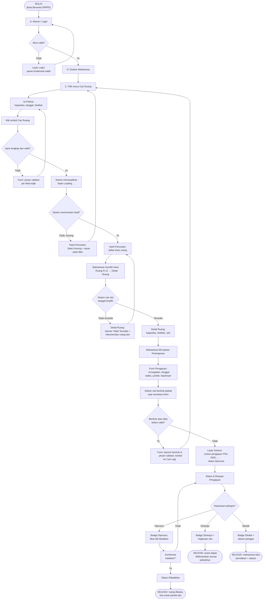

# 03 — User Flow: Mahasiswa (Peminjam)

**Tujuan alur:** Mahasiswa (ketua panitia) menemukan ruang yang cocok → mengajukan peminjaman → memantau status sampai ada keputusan. Tanpa jalan buntu: setiap keputusan punya jalur lanjut atau kembali.

---

## 1. Diagram User Flow (Mermaid flowchart)

### Happy path ringkas
**MULAI → Login → Dasbor → Cari Ruang → Hasil (ada) → Detail (tersedia) → Form → Valid → **Sukses PNJ-2026-00123 → Status Riwayat → Disetujui → SELESAI.**

### Jalur gagal / alternatif (tidak ada jalan buntu)
1. **Login gagal** → pesan error → kembali mengisi login.
2. **Input tidak lengkap** → validasi per field → perbaiki form.
3. **Tidak ada hasil** → State Kosong + saran ubah filter → kembali ke Cari Ruang.
4. **Ruang tidak tersedia** → banner + rekomendasi ruang lain → kembali ke Hasil.
5. **Jadwal bentrok saat submit** → pesan bentrok → tombol "Cari Lagi" → kembali ke Cari Ruang.
6. **Status Ditolak** → alasan tampil → mahasiswa dapat mengajukan ulang (kembali ke Cari Ruang).

---

## 2. Skenario Flow (Format Tabel)

**Skenario uji:** *"Anda ketua panitia yang membutuhkan ruang untuk 50 peserta pada 15 Oktober 2026. Temukan, periksa fasilitas, ajukan, lalu pastikan status dapat ditemukan kembali."*

| Langkah | Aktor | Aksi | Respons Sistem | Keputusan/Kondisi | Layar |
|---------|-------|------|----------------|-------------------|-------|
| 1 | Mahasiswa | Membuka aplikasi & klik **Masuk**, isi NIM & sandi | Validasi kredensial | Jika salah → pesan error (ulang Langkah 1) | H-PUB-02 Masuk |
| 2 | Sistem | Arahkan ke dasbor pengguna | Tampil ringkasan pengajuan & menu utama | Login berhasil | H-USER-01 Dasbor |
| 3 | Mahasiswa | Klik menu **Cari Ruang** | Buka form pencarian | — | H-USER-02 |
| 4 | Mahasiswa | Isi kapasitas ≥ 50, tanggal 15/10/2026, centang fasilitas (AC, Proyektor) | Validasi input | Tidak lengkap → pesan validasi (ulang Langkah 4) | H-USER-02 |
| 5 | Sistem | Jalankan pencarian → **State Loading** | Spinner/skeleton | — | H-USER-02 (varian loading) |
| 6 | Sistem | Tampilkan hasil sesuai filter | Jika kosong → saran ubah filter (kembali Langkah 4) | Ada hasil / kosong | H-USER-03 |
| 7 | Mahasiswa | Memilih kartu **R.12 Auditorium** | Buka detail ruang | — | H-USER-04 |
| 8 | Sistem | Cek ketersediaan slot 15/10 | Jika tidak tersedia → banner + rekomendasi (kembali Langkah 7) | Tersedia / tidak | H-USER-04 (state) |
| 9 | Mahasiswa | Klik **Ajukan Peminjaman** | Buka form pengajuan | — | H-USER-05 |
| 10 | Mahasiswa | Isi nama kegiatan, BP, tanggal, waktu 08.00–12.00, jumlah ≥ 50, keperluan | Validasi & cek bentrok saat **Kirim** | Bentrok/error → banner + tombol "Cari Lagi" | H-USER-05 (state) |
| 11 | Sistem | Simpan pengajuan → tampil **nomor PNJ-2026-00123**, status Diproses | Konfirmasi sukses | — | H-USER-05 (state sukses) / H-USER-06 |
| 12 | Mahasiswa | Buka **Status & Riwayat**, lihat badge **Diproses** | Status tersedia & dapat dibatalkan | Tetap diproses / berubah | H-USER-06 |
| 13 | Sistem | Petugas meninjau & mengubah status (lihat file 04) | Badge berubah menjadi **Disetujui** / **Ditolak** | Keputusan petugas | H-USER-06 (sinkron) |
| 14 | Mahasiswa | Membaca hasil keputusan (disetujui + jadwal, atau ditolak + alasan) | Informasi jelas, bisa mengajukan ulang | — | H-USER-06 → SELESAI |