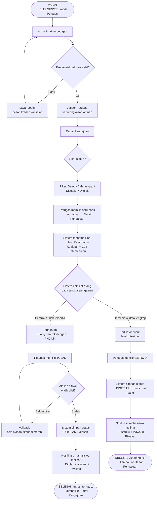

# 04 — User Flow: Petugas/Admin

**Tujuan alur:** Petugas meninjau pengajuan masuk, memverifikasi data & ketersediaan ruang, lalu mengubah status (Disetujui/Ditolak dengan alasan). Hasil keputusan langsung tercermin di halaman Status & Riwayat mahasiswa (file 03).

---

## 1. Diagram User Flow (Mermaid flowchart)

### Happy path ringkas
**MULAI → Login Petugas → Dasbor → Daftar Pengajuan (filter Menunggu) → Detail Pengajuan → ketersediaan OK → **Setujui** → status tersimpan → mahasiswa melihat Disetujui → SELESAI.**

### Jalur gagal / alternatif (tidak ada jalan buntu)
1. **Login petugas gagal** → pesan error → ulangi login.
2. **Ruang bentrok / tidak tersedia** → sistem menampilkan peringatan → petugas memilih **Tolak** dan wajib mengisi alasan.
3. **Alasan belum diisi saat menolak** → validasi field → lengkapi alasan → simpan.
4. **Data pemohon tidak lengkap** → petugas dapat mengirim tanda "Perlu Perbaikan"/menolak dengan alasan → pengajuan kembali ke pemohon (kembali ke daftar).
5. Kapan pun petugas dapat **kembali ke Daftar Pengajuan** tanpa menyimpan — tidak ada jalan buntu.

---

## 2. Skenario Flow (Format Tabel)

**Skenario uji:** *"Anda petugas administrasi. Masuk sebagai petugas, tinjau pengajuan PNJ-2026-00123 (Ruang R.12, 15 Oktober 2026), pastikan tidak bentrok, lalu ubah status menjadi Disetujui. Setelah itu, tinjau satu pengajuan yang bentrok dan tolak dengan alasan."*

| Langkah | Aktor | Aksi | Respons Sistem | Keputusan/Kondisi | Layar |
|---------|-------|------|----------------|-------------------|-------|
| 1 | Petugas | Masuk dengan akun petugas | Validasi kredensial | Salah → pesan error (ulang Langkah 1) | H-PUB-02 Masuk |
| 2 | Sistem | Arahkan ke **Dasbor Petugas** | Kartu ringkasan: Menunggu (5), Disetujui (3), Ditolak (2) | Login berhasil | H-OFF-01 |
| 3 | Petugas | Buka **Daftar Pengajuan**, pilih filter **Menunggu** | Daftar diurutkan, paling lama di atas | — | H-OFF-02 |
| 4 | Petugas | Pilih baris **PNJ-2026-00123** | Tampil detail pemohon & kegiatan + cek ketersediaan | — | H-OFF-03 |
| 5 | Sistem | Periksa slot R.12 pada 15/10/2026 | Indikator **Tersedia — tidak bentrok** | Tersedia / Bentrok | H-OFF-03 (state) |
| 6 | Petugas | Klik **Setujui** | Simpan status **Disetujui**, kunci slot; notifikasi ke pemohon | (kasus happy path) | H-OFF-03 |
| 7 | Petugas | Kembali ke daftar, pilih pengajuan lain yang **bentrok** | Peringatan bentrok dengan PNJ lain | Bentrok | H-OFF-03 (state) |
| 8 | Petugas | Klik **Tolak**, alasan belum diisi | Validasi: "Alasan wajib diisi" → field ditandai | Alasan kosong | H-OFF-03 (validasi) |
| 9 | Petugas | Ketik alasan "Slot sudah terisi PNJ-…" lalu **Simpan Penolakan** | Status **Ditolak** tersimpan; mahasiswa melihat alasan di Riwayat | Alasan terisi | H-OFF-03 → H-USER-06 |
| 10 | Sistem | Kembali ke **Daftar Pengajuan** siap meninjau berikutnya | Antrian terbaru tampil | — | H-OFF-02 → SELESAI |